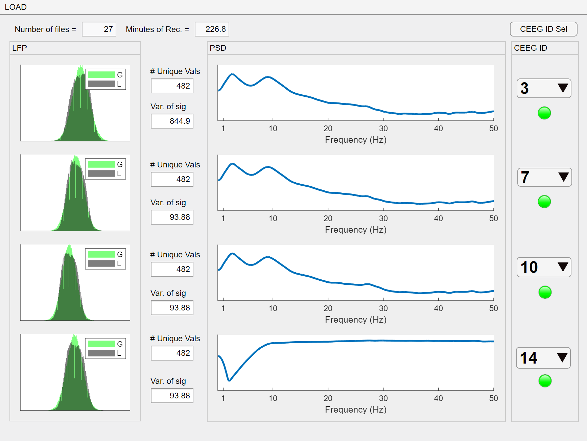

# UH3-RestoreSleepPD Study

#### Matlab app to assess LFP from brief recording

<!-- PROJECT LOGO -->
<br />

<p align="center">
  <a href="https://github.com/UH3-RestoreSleepPD/SleepVideoRecord">
    
  </a>

  <h3 align="center">LFP Quality Control Application</h3>

  <p align="center">
    Matlab GUI application to assess short LFP recording
    <br />
    <a href="https://github.com/UH3-RestoreSleepPD/SingleNightSignalCheck"><strong>Explore the docs »</strong></a>
    <br />
    <br />
      <a href="https://github.com/UH3-RestoreSleepPD/SingleNightSignalCheck/blob/main/SNSC_Abv_App_02182021.mlapp"><strong>Latest Version »</strong></a>
    <br />
    <br />
    ·
    <a href="https://github.com/UH3-RestoreSleepPD/SingleNightSignalCheck/issues">Report Bug</a>
    ·
    <a href="https://github.com/UH3-RestoreSleepPD/SingleNightSignalCheck/issues">Request Feature</a>
  </p>


</p>

------

## How to Use:

##### 1. Enter name of GUI application in Command Window

```matlab
>> SNSC_Abv_App_02162021
```

##### 1. Press the LOAD button


##### 2. If the Channels pass the quality control check then the lights will turn green




